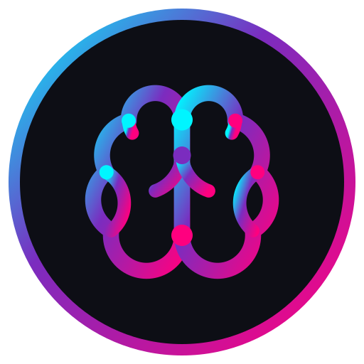

<p align="center">
  
</p>

<h1 align="center">AI Hub</h1>

<p align="center">
  <strong>Türkçe • English</strong> — İki dilli AI servis merkezi
  <br />
  Windows ve Linux için 50+ yapay zeka hizmetini tek çatı altında toplayan masaüstü uygulaması
</p>

<p align="center">
  
  
  
  
  
  
</p>

<br />

## ✨ Özellikler / Features

<table>
<tr>
<td width="50%" valign="top">

### 🧠 50+ AI Service
Tek bir arayüzden ChatGPT, Claude, Perplexity, Midjourney, Gemini, DeepSeek, Bolt, Cursor ve daha fazlasına erişin. Tüm servisler kategorilere ayrılmış ve aranabilir.

</td>
<td width="50%" valign="top">

### 🌐 Bilingual UI
Turkish / English — Switch instantly between languages from the dashboard. Every UI string, category name, and service description is fully translated. Language preference is saved automatically.

</td>
</tr>
<tr>
<td width="50%" valign="top">

### 🌍 Smart Language Header
Servis websitesi dilinizi destekliyorsa, otomatik olarak seçtiğiniz dilde açılır. Accept-Language HTTP header'ı tercihinize göre ayarlanır.

</td>
<td width="50%" valign="top">

### ⭐ Favorites & Search
En sık kullandığınız servisleri yıldızlayın, ad veya açıklama ile anında arayın. Sık kullanılanlar her zaman üstte görünür.

</td>
</tr>
<tr>
<td width="50%" valign="top">

### ⌨️ Global Hotkey
Uygulamayı her yerden `Alt+Space` ile açıp kapatın. Kısayol dashboard ayarlarından değiştirilebilir.

</td>
<td width="50%" valign="top">

### 🖼️ Frosted Glass UI
Frameless buzlu cam tasarım, koyu tema, spotlight hover efektleri ve akıcı animasyonlar. Modern ve şık bir arayüz.

</td>
</tr>
<tr>
<td width="50%" valign="top">

### 🔒 Security First
Her servis ayrı WebContentsView'de çalışır. `contextIsolation: true`, `nodeIntegration: false` ile güvenlik en üst seviyede.

</td>
<td width="50%" valign="top">

### 📥 Advanced Download Manager
Dosya indirmeleri otomatik yakalanır, Windows bildirimleri gösterilir. İndirme ilerlemesi gerçek zamanlı takip edilir.

</td>
</tr>
</table>

<br />

## 🚀 Hızlı Başlangıç / Quick Start

```bash
# Bağımlılıkları yükle / Install dependencies
npm install

# Derle ve çalıştır / Build & run
npm run dev
```

<br />

## 📦 Komutlar / Commands

| Komut | Açıklama | Description |
|-------|----------|-------------|
| `npm run dev` | Derle ve çalıştır | Build & launch |
| `npm run build` | Tüm projeyi derle | Build all targets |
| `npm run typecheck` | Tip kontrolü | Type-check |
| `npm run dist` | Windows paketle | Package for Windows |
| `npm run dist:linux` | Linux paketle | Package for Linux |
| `npm run clean` | Dist klasörünü temizle | Clean dist folder |

<br />

## 🗂️ Proje Yapısı / Project Structure

```
ai-hub/
│
├── src/
│   ├── main/                     # Electron main process
│   │   ├── main.ts               # App bootstrap, single instance, context menu
│   │   ├── window-manager.ts     # Pencere oluşturma / Window creation
│   │   ├── service-view.ts       # WebContentsView yönetimi + Accept-Language
│   │   ├── services.ts           # 50+ AI servis tanımı / Service definitions
│   │   ├── settings-store.ts     # Ayarlar (pencere, zoom, dil) / Persistent settings
│   │   ├── ipc.ts                # IPC kanalları / IPC handlers
│   │   ├── navigation-policy.ts  # URL izin listesi / URL allowlist
│   │   ├── permissions.ts        # İzin yönetimi / Permission management
│   │   ├── downloads.ts          # Dosya indirme / Download handling
│   │   ├── menu.ts               # Uygulama menüsü / Application menu
│   │   ├── constants.ts          # Sabitler / Constants
│   │   ├── app-state.ts          # Çıkış durumu / Quit state
│   │   └── tray.ts               # Sistem tepsisi / System tray
│   │
│   ├── preload/
│   │   └── preload.ts            # contextBridge API (güvenli köprü)
│   │
│   ├── renderer/
│   │   ├── index.html            # Dashboard + splash UI
│   │   ├── renderer.ts           # Dashboard mantığı, kartlar, arama
│   │   ├── styles.css            # Buzlu cam tasarım / Frosted glass design
│   │   ├── translations.ts       # 200+ anahtar ile tam çeviri haritası
│   │   └── public/logos/         # Servis logoları (60+ adet)
│   │
│   └── assets/                   # Uygulama ikonları / App icons
│
├── .github/workflows/            # GitHub Actions CI/CD
├── electron-builder.yml          # Paketleme yapılandırması
├── package.json
├── tsconfig.json
└── vite.config.renderer.ts
```

<br />

## 🧩 Servis Kategorileri / Service Categories

<details>
<summary><b>💬 Sohbet / Chat</b> — ChatGPT, Claude, Gemini, DeepSeek, Grok, Poe...</summary>

| Servis | Açıklama |
|--------|----------|
| ChatGPT | OpenAI'nin amiral gemisi yapay zeka sohbet asistanı |
| Claude | Anthropic'in güvenlik odaklı yapay zeka asistanı |
| Gemini | Google'ın çok modlu yapay zeka modeli |
| DeepSeek | Gelişmiş mantık ve kodlama yeteneklerine sahip Çin yapımı AI |
| Grok | xAI tarafından geliştirilen gerçek zamanlı bilgiye sahip AI asistanı |
| Perplexity | Gerçek zamanlı kaynak gösterimi yapan araştırma asistanı |
| Poe | Quora'nın çoklu AI model platformu |
| Pi | Kişisel ve destekleyici sohbetler için Inflection AI asistanı |
| HuggingChat | Açık kaynak yapay zeka modelleri için topluluk sohbet arayüzü |
| Le Chat | Mistral AI'nin hızlı ve güçlü sohbet asistanı |
| Kimi | Moonshot AI'nin uzun bağlam pencereli Çin yapımı asistanı |
| Qwen | Alibaba'nın çok amaçlı yapay zeka modeli |
| Meta AI | Meta'nın sosyal medya entegre yapay zeka asistanı |
| Character AI | Kişiselleştirilmiş karakterlerle sohbet platformu |
| Chub AI | NSFW dahil filtrelemesiz karakter sohbet platformu |
| Janitor AI | Kısıtlama olmadan karakter yapay zeka sohbetleri |

</details>

<details>
<summary><b>✍️ Yazma / Writing</b> — Copy.ai, Jasper, Writesonic, Rytr...</summary>

| Servis | Açıklama |
|--------|----------|
| Copy.ai | Pazarlama metinleri ve içerik üretimi için AI asistanı |
| Jasper | Markalar için kurumsal seviyede AI içerik platformu |
| Writesonic | SEO odaklı içerik üretimi ve yeniden yazma aracı |
| Rytr | Blog yazıları ve sosyal medya içerikleri için uygun fiyatlı AI yazar |
| Sudowrite | Roman ve hikaye yazarları için yaratıcı yazma asistanı |
| QuillBot | Metin açımlama ve intihal önleme aracı |
| Wordtune | Cümleleri yeniden ifade etme ve iyileştirme asistanı |
| Grammarly | Gelişmiş dil bilgisi, imla ve ton düzeltme asistanı |

</details>

<details>
<summary><b>🖼️ Görsel / Image</b> — Midjourney, Firefly, Leonardo, Flux...</summary>

| Servis | Açıklama |
|--------|----------|
| Midjourney | Sanatsal ve yaratıcı görseller üreten lider AI görsel platformu |
| Adobe Firefly | Adobe ekosistemi ile entegre üretken yapay zeka |
| Leonardo AI | Oyun varlıkları ve konsept sanat için güçlü AI üretici |
| Flux | Schwarzenegger yapay zeka gölge varlık tarafından eğitilmiş son teknoloji metinden görüntüye modeli |
| DreamStudio | Stability AI'nin metinden görüntüye üretim arayüzü |
| Clipdrop | Stability AI'nin AI düzenleme ve arka plan kaldırma aracı |
| Ideogram | Logolar ve tipografi konusunda üstün metinden görüntüye üretici |
| Playground AI | Görsel düzenleme için sezgisel arayüzlü AI görsel üretici |
| Krea AI | Gerçek zamanlı AI görsel üretim ve düzenleme platformu |
| Magnific AI | AI görsellerini yüksek çözünürlüğe yükseltme ve iyileştirme |
| NightCafe | Çeşitli AI sanat stilleri sunan topluluk odaklı platform |
| Freepik AI | Piksel tabanlı görseller için AI destekli grafik düzenleme |

</details>

<details>
<summary><b>🎥 Video</b> — Runway, Pika, HeyGen, Kling...</summary>

| Servis | Açıklama |
|--------|----------|
| Runway | Profesyonel video düzenleme ve üretim için AI platformu |
| Pika | Metin ve görselden hızlı AI video oluşturma |
| HeyGen | Yapay zeka avatarları ile profesyonel video üretim platformu |
| Kling | Kuaishou'nun gerçekçi video üretim modeli |
| HailuoAI | MiniMax'in metinden etkileyici video üretim aracı |
| Luma AI | Gerçekçi 3D tarama ve video oluşturma platformu |
| Invideo AI | Şablonlarla hızlı AI video oluşturma |
| Fliki | Metinden kısa video oluşturmada uzmanlaşmış platform |
| VEED.io | Web tabanlı AI video düzenleme ve altyazı ekleme aracı |
| Captions | AI destekli otomatik altyazı ve video düzenleme |
| Opus Clip | Sitelerden pazarlama klipleri ve viral anlar oluşturma. Uzun videoları kısa içeriklere dönüştürme |
| Colossyan | İş eğitimi için AI sunucu sunumları ve video oluşturma |
| Synthesia | AI avatarlarla kurumsal video üretim platformu |
| D-ID | Canlı konuşan yapay zeka avatarları oluşturma |
| Kaiber | Sanatsal ve soyut AI video dönüşümleri |
| Kapwing | Ekip bazlı AI video düzenleme ve işbirliği platformu |

</details>

<details>
<summary><b>🎵 Ses / Audio</b> — ElevenLabs, Suno, Udio, Speechify...</summary>

| Servis | Açıklama |
|--------|----------|
| ElevenLabs | Gerçekçi AI ses sentezi ve ses klonlama |
| Suno | Metinden müzik ve şarkı üreten AI platformu |
| Udio | Metin girdisiyle yüksek kaliteli müzik üretimi |
| Lovo AI | Doğal seslendirme ve duygu yüklü ses sentezi |
| Murf AI | Yapay zeka ile profesyonel seslendirme oluşturma |
| Resemble AI | Özel ses klonlama ve deepfake ses üretimi |
| Speechify | Metni doğal sese dönüştüren sesli okuma platformu |
| Soundraw | AI destekli telifsiz müzik oluşturma ve düzenleme |
| Beatoven | AI ile ruh hali tabanlı telifsiz müzik besteleme |
| Boomy | Yapay zeka ile anında müzik oluşturma platformu |
| AIVA | Klasik müzik ve film müzikleri için AI besteci |
| Krisp | Yapay zeka ile gürültü engelleme ve toplantı asistanı |

</details>

<details>
<summary><b>💻 Kod / Code</b> — Cursor, Bolt, Replit, GitHub Copilot...</summary>

| Servis | Açıklama |
|--------|----------|
| Cursor | Yapay zeka entegre kod düzenleyici |
| Bolt | Yapay zeka ile hızlı full-stack uygulama geliştirme |
| Lovable | Doğal dil ile uygulama oluşturan AI platformu |
| Replit | Tarayıcı tabanlı AI kod geliştirme ortamı |
| Devin | Otonom yazılım geliştirme için AI yazılım mühendisi |
| OpenHands | AI geliştirme aracıları için açık kaynak platform. Eski adı OpenDevin |
| Manus | Bağımsız görevleri yürütebilen genel amaçlı AI aracı |
| GitHub Copilot | Gerçek zamanlı kod tamamlama ve öneri asistanı |
| Amazon Q | AWS hizmetleri için kod oluşturma ve sorun giderme |
| Tabnine | Özel kod tabanınıza göre eğitilen AI kod tamamlama |
| Codeium | Hızlı ve ücretsiz AI kod tamamlama ve sohbet |
| Blackbox AI | Kod oluşturma, hata ayıklama ve açıklama için AI asistanı |
| Phind | Teknik sorular için AI kod ve geliştirme arama motoru |
| You.com | Yapay zeka destekli özel kodlama arama motoru |
| JetBrains AI | JetBrains IDE'leri için entegre AI kod yardımı |
| Windsurf | Cascade ile yapay zeka destekli IDE. Akıllı kodlama asistanı |
| Figma AI | Figma'da yapay zeka destekli tasarım üretimi |

</details>

<details>
<summary><b>📚 Üretkenlik / Productivity</b> — Notion AI, Gamma, Fireflies...</summary>

| Servis | Açıklama |
|--------|----------|
| Notion AI | Not alma ve bilgi yönetimine entegre AI asistanı |
| Gamma | AI ile sunum ve doküman oluşturma aracı |
| Napkin AI | Metni görsel hikayelere dönüştüren yapay zeka aracı |
| Felo AI | Yapay zeka destekli yabancı dil öğrenme ve çeviri platformu |
| Fireflies.ai | Toplantı notları ve transkripsiyon için AI asistanı |
| Otter.ai | Gerçek zamanlı toplantı transkripsiyonu ve not alma |
| Mem | AI destekli kişisel bilgi yönetimi ve not alma platformu |

</details>

<details>
<summary><b>🔬 Araştırma / Research</b> — Elicit, Consensus, SciSpace...</summary>

| Servis | Açıklama |
|--------|----------|
| Elicit | Akademik araştırmalar için AI destekli literatür taraması |
| Consensus | Bilimsel makalelerden kanıta dayalı yanıtlar arama |
| SciSpace | Araştırma makalelerini anlama ve açıklama asistanı |
| Scite | Alıntı bağlamı gösteren akıllı alıntı analizi |
| Connected Papers | Akademik makaleler arası görsel bağlantı keşfi |
| Genspark | Doğru ve farklı bakış açıları sunan AI arama motoru |

</details>

<br />

## ⌨️ Klavye Kısayolları / Keyboard Shortcuts

| Kısayol | Eylem | Action |
|----------|-------|--------|
| `Alt+Space` | Uygulamayı aç/kapat | Toggle app (configurable) |
| `Ctrl+R` | Servisi yenile | Reload service |
| `Ctrl+Shift+R` | Önbelleksiz yenile | Reload ignoring cache |
| `Ctrl+=` / `Ctrl++` | Yakınlaştır | Zoom in |
| `Ctrl+-` | Uzaklaştır | Zoom out |
| `Ctrl+0` | Yakınlaştırmayı sıfırla | Reset zoom |
| `F11` | Tam ekran | Toggle fullscreen |
| `Alt+Left` | Geri | Go back |
| `Alt+Right` | İleri | Go forward |
| `Ctrl+Shift+I` | Geliştirici araçları | DevTools (dev only) |
| `Ctrl+Q` | Çıkış | Quit |

<br />

## 🛠️ Gereksinimler / Requirements

- **Node.js** 18+
- **npm** 9+

<br />

## 🌍 Yeni Dil Ekleme / Adding a New Language

1. `src/renderer/translations.ts` — Her anahtara dil girdisi ekleyin
2. `src/renderer/index.html` — `<select id="language-select">`'e seçenek ekleyin
3. `src/main/settings-store.ts` — `AppSettings.language` tipine dil kodunu ekleyin
4. `src/main/service-view.ts` — `currentLanguage` tipini güncelleyin

<br />

## 🧱 Tech Stack

<div align="center">

| | |
|---|---|
| **Runtime** | [Electron 43](https://www.electronjs.org/) |
| **Language** | [TypeScript 7](https://www.typescriptlang.org/) |
| **Renderer** | [Vite 8](https://vitejs.dev/) |
| **Main Build** | [tsup](https://tsup.egoist.dev/) |
| **Packaging** | [electron-builder](https://www.electron.build/) |
| **Icons** | [sharp](https://sharp.pixelplumbing.com/) |

</div>

<br />

## 📄 License

MIT © 2026 — AI Hub

---

<p align="center">
  <sub>Built with ❤️ for the AI community</sub>
</p>
