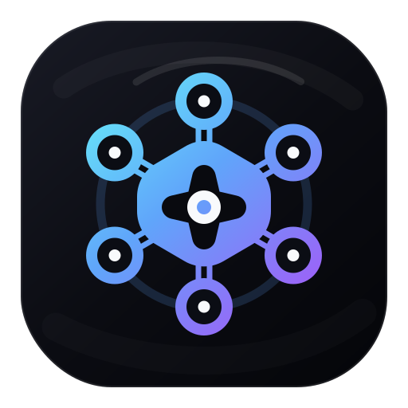

<p align="center">
  
</p>

<h1 align="center">AI Hub</h1>

<p align="center">
  <strong>Türkçe • English</strong> — İki dilli AI servis merkezi
  <br />
  Windows ve Linux için 50+ yapay zeka hizmetini tek çatı altında toplayan masaüstü uygulaması
</p>

<p align="center">
  
  
  
  
  
  
</p>

<br />

## 📐 Mimarlık ve Standartlar / Architecture & Standards

Bu proje **Kıdemli Mimarlık ve Kod Kalitesi Standartları** uygulanarak modülerleştirilmiştir:

* **Feature-Driven Architecture**: Renderer üzerindeki ekranlar ve servisler feature bazlı dizinlerde toplanmıştır (`src/renderer/features/*`).
* **IPC API Client Abstraction**: Preload köprüsü direct DOM çağrıları yerine tip güvenli `IpcClientService` üzerinden tüketilir.
* **Unified Class Components**: Tüm UI bileşenleri (`TitlebarComponent`, `TabsComponent`, `OverlayComponent`, `DashboardComponent`, `SettingsComponent`) kapsüllenmiş Class yapısındadır.
* **Centralized AppError & Logging**: Hata ve log yönetimi `AppError` sınıfı ve `Logger` yardımcısı ile standardize edilmiştir.
* **Security First**: `certificate-error` bypass'ı kaldırılmış, context isolation ve safe URL politikaları sıkılaştırılmıştır.

---

## ✨ Özellikler / Features

<table>
<tr>
<td width="50%" valign="top">

### 🧠 50+ AI Service
Tek bir arayüzden ChatGPT, Claude, Perplexity, Midjourney, Gemini, DeepSeek, Bolt, Cursor ve daha fazlasına erişin. Tüm servisler kategorilere ayrılmış ve aranabilir.

</td>
<td width="50%" valign="top">

### 🌐 Bilingual UI
Turkish / English — Switch instantly between languages from the dashboard. Every UI string, category name, and service description is fully translated. Language preference is saved automatically.

</td>
</tr>
<tr>
<td width="50%" valign="top">

### 🌍 Smart Language Header
Servis websitesi dilinizi destekliyorsa, otomatik olarak seçtiğiniz dilde açılır. Accept-Language HTTP header'ı tercihinize göre ayarlanır.

</td>
<td width="50%" valign="top">

### ⭐ Favorites & Search
En sık kullandığınız servisleri yıldızlayın, ad veya açıklama ile anında arayın. Sık kullanılanlar her zaman üstte görünür.

</td>
</tr>
<tr>
<td width="50%" valign="top">

### ⌨️ Global Hotkey
Uygulamayı her yerden `Alt+Space` ile açıp kapatın. Kısayol dashboard ayarlarından değiştirilebilir.

</td>
<td width="50%" valign="top">

### 🖼️ Frosted Glass UI
Frameless buzlu cam tasarım, koyu tema, spotlight hover efektleri ve akıcı animasyonlar. Modern ve şık bir arayüz.

</td>
</tr>
<tr>
<td width="50%" valign="top">

### 🔒 Security First
Her servis ayrı WebContentsView'de çalışır. `contextIsolation: true`, `nodeIntegration: false` ile güvenlik en üst seviyede.

</td>
<td width="50%" valign="top">

### 📥 Advanced Download Manager
Dosya indirmeleri otomatik yakalanır, Windows bildirimleri gösterilir. İndirme ilerlemesi gerçek zamanlı takip edilir.

</td>
</tr>
</table>

<br />

## 🚀 Hızlı Başlangıç / Quick Start

```bash
# Bağımlılıkları yükle / Install dependencies
npm install

# Derle ve çalıştır / Build & run
npm run dev
```

<br />

## 📦 Komutlar / Commands

| Komut | Açıklama | Description |
|-------|----------|-------------|
| `npm run dev` | Derle ve çalıştır | Build & launch |
| `npm run build` | Tüm projeyi derle | Build all targets |
| `npm run typecheck` | Tip kontrolü | Type-check |
| `npm run dist` | Windows paketle | Package for Windows |
| `npm run dist:linux` | Linux paketle | Package for Linux |
| `npm run clean` | Dist klasörünü temizle | Clean dist folder |

<br />

## 🗂️ Proje Yapısı / Project Structure

```text
ai-hub/
├── src/
│   ├── shared/                   # Ortak sabitler, hatalar, tipler ve yardımcılar
│   │   ├── constants/            # IPC kanalları (ipc.ts) & Uygulama sabitleri (app.ts)
│   │   ├── errors/               # Standart AppError sınıfları ve guard'lar
│   │   ├── types/                # Domain & Uygulama tipleri
│   │   └── utils/                # Loglama (Logger) ve yardımcı sınıflar
│   │
│   ├── main/                     # Electron main process
│   │   ├── main.ts               # App bootstrap, single instance, context menu
│   │   ├── window-manager.ts     # Pencere oluşturma / Window creation
│   │   ├── service-view.ts       # WebContentsView yönetimi & sekme yapısı
│   │   ├── services.ts           # 50+ AI servis tanımı / Service definitions
│   │   ├── settings-store.ts     # Ayarlar (pencere, zoom, dil) / Persistent settings
│   │   ├── ipc.ts                # IPC handlers & mesaj doğrulamaları
│   │   ├── navigation-policy.ts  # URL izin listesi / URL allowlist
│   │   ├── permissions.ts        # İzin yönetimi / Permission management
│   │   ├── downloads.ts          # Dosya indirme / Download handling
│   │   ├── menu.ts               # Uygulama menüsü / Application menu
│   │   ├── constants.ts          # Main process sabitleri
│   │   ├── app-state.ts          # Çıkış durumu / Quit state
│   │   └── tray.ts               # Sistem tepsisi / System tray
│   │
│   ├── preload/
│   │   └── preload.ts            # contextBridge API (güvenli IPC köprüsü)
│   │
│   ├── renderer/
│   │   ├── index.html            # Dashboard + splash UI
│   │   ├── renderer.ts           # Renderer bootstrap ve görünüm yönlendirici
│   │   ├── features/             # Feature modülleri (DashboardComponent, SettingsComponent)
│   │   ├── components/           # Ortak UI bileşenleri (TitlebarComponent, TabsComponent, OverlayComponent)
│   │   ├── services/             # Renderer servisleri (IpcClientService, i18n, Storage)
│   │   ├── styles/               # CSS modülleri ve tasarım tokens
│   │   └── public/logos/         # Servis logoları
│   │
│   └── assets/                   # Uygulama ikonları / App icons
│
├── electron-builder.yml          # Paketleme yapılandırması
├── package.json
├── tsconfig.json
└── vite.config.renderer.ts
```

<br />

## 🧱 Tech Stack

<div align="center">

| | |
|---|---|
| **Runtime** | [Electron 43](https://www.electronjs.org/) |
| **Language** | [TypeScript 7](https://www.typescriptlang.org/) |
| **Renderer** | [Vite 8](https://vitejs.dev/) |
| **Main Build** | [tsup](https://tsup.egoist.dev/) |
| **Packaging** | [electron-builder](https://www.electron.build/) |
| **Icons** | [sharp](https://sharp.pixelplumbing.com/) |

</div>

<br />

## 📄 License

MIT © 2026 — AI Hub

---

<p align="center">
  <sub>Built with ❤️ for the AI community</sub>
</p>
